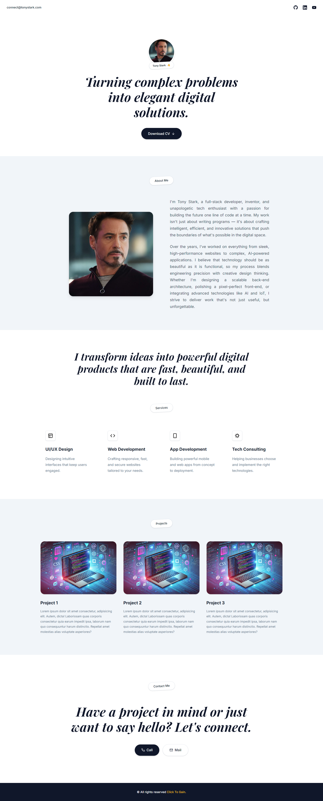

# Bài tập - Clone Portfolio

## Yêu cầu

Sinh viên cần chỉnh giao diện để kết quả render giống hình mẫu trong:

- `reference/reference.png`

Sinh viên cần chỉnh **2 file** trong thư mục `src`:

- `src/index.html`
- `src/style.css`

### Hình mẫu tham khảo

## Hướng dẫn làm bài

1. Chỉnh cấu trúc HTML trong `src/index.html`.
2. Chỉnh CSS trong `src/style.css`.
3. Mục tiêu là giao diện render giống `reference/reference.png` nhất có thể.

## Hướng dẫn nộp bài

1. Commit và push các thay đổi lên GitHub.
2. Hệ thống sẽ tự động chấm dựa trên ảnh render so với ảnh mẫu.
